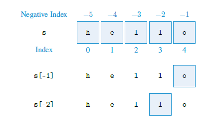
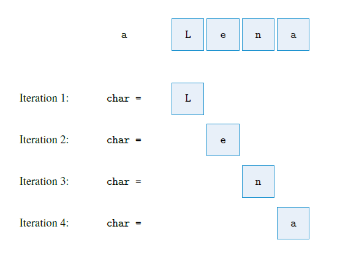
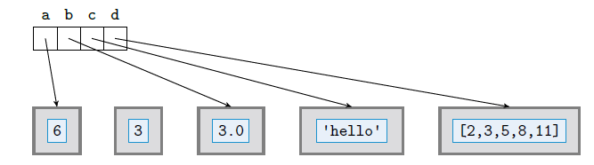
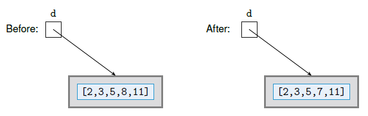
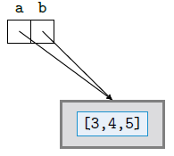
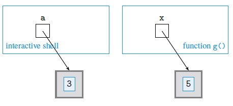
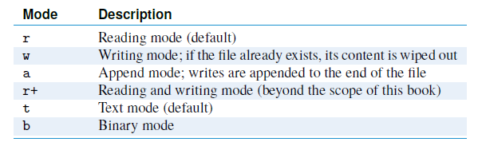

[TOC]


# Chapter 1:Introduction to Computer Science

**voluntary but useful reading**


# Chapter 2:Python Data Types

**ALL**

## 2.1 Expressions, Variables, and Assignments

### 1. Algebraic Expressions and Functions

```python
>>> 3+7
```

hit the <kbd>Enter</kbd> key on the keyboard to view result of evaluating the expression:

```python
10
```

So, let's try expressions that use different algebraic operators:

```python
>>> 3 * 2
6
>>> 5 / 2
2.5
>>> 4 / 2
2.0
```

tips: in the third expression, an integer is divided by another and the result is shown in <u>decimal point notation(小数形式)</u>. This is because when an integer is divided by another,the result is not necessarily an integer. The rule in Python is return a number with a decimal point and a fractional part, even when the result is an integer. `(Perkovic, 2005, p. 16)`

Number without the decimal point are said to be of *type integer* or simply *int*. Values with decimal points and fractional parts are said to be of type *floating point* or simply *float*.

**ATTENTION:** The standard algebra *precedence rules* apply in python: ==Multiplication and division take precedence over addition and subtraction, parentheses are used when we want to explicitly specify the order in which operations should take place.== If all else fails, expressions are evaluated from using the `left-to-right evaluation` rule. This last rule is used in the next expression, where the addition is executed **after** the subtraction

When two int values are added(+), subtracted(-), or multiplied(*), the result is an int value. if at least one float value appears in the expression, however, **the result is always a float value**. Note that a float value is also obtained when two integer values are divided.

**Exponentiation Operator**

```python
>>>2**3
8
>>>2**4
16
```

**Integer Quotient & Remainder**

The `//` operator in expression `a//b` returns the integer quotient (The result's type is `int`). The `%` operator in expression `a%b` computes the remainder (The result's type is `int`).

```python
>>>14//3
4
>>>14%3
2
>>>type(14//3)
<class 'int'>
>>>type(14%3)
<class 'int'>
```

**Absolute, Max, and Min**

```python
import math
abs(-4) #4
abs(3) #4, integer type
abs(3.2) #3.2, floating point

min(6,-2) #-2
max(6,-2) #6
min(2, -4, 6, -2) #-4
max(12, 26.5, 3.5) #26.5
```

### 2. Boolean Expressions and Operators

#### and

|   p   |   q   | p and q |
| :---: | :---: | :-----: |
| true  | true  |  true   |
| true  | false |  false  |
| false | true  |  false  |
| false | false |  false  |

#### or

|   p   |   q   | p or q |
| :---: | :---: | ------ |
| true  | true  | true   |
| true  | false | true   |
| false | true  | true   |
| false | false | false  |

#### not

|   p   | not p |
| :---: | :---: |
| true  | false |
| false | true  |

### 3. Variables and Assignment

in Python, a value can be assigned to a variable:

```python
>>>x = 4
# <cariable> = <expression>
>>>x
4
```

**CAUTION**: Be careful to distinguish the assignment statement `=` and the equality operator `==`.

**About Variables' Name**: The characters making up a variable name can be lowercase and uppercase letters from the alphabet (a through z and A through Z), the underscore character (_), and, except for the first character, digits 0 through 9.

The names below are used as reserved keywords of the Python language. You cannot use them other than as Python commands:

| False  | break    | else    | if       | not    | while |
| ------ | -------- | ------- | -------- | ------ | ----- |
| None   | class    | except  | import   | or     | with  |
| True   | continue | finally | in       | pass   | yield |
| and    | def      | for     | is       | raise  |       |
| as     | del      | from    | lambda   | return |       |
| assert | elif     | global  | nonlocal | try    |       |

## 2.2 Strings

The Python string type, denoted str, is used to represent and manipulate text data or, in other words, a sequence of characters, including blanks, punctuation, and various symbols. A string value is represented as a sequence of characters that is enclosed within quotes:

```python
>>> 'Hello, World!'
'Hello, World!'
>>> s = 'hello'
>>> s
'hello'
```

### 1. String Operators

Like numbers, strings can be compared using comparison operators: ==, !=, < , >, and so on. Operator ==, for example, returns True if the strings on either side of the operator have the same value:

```python
>>> s == 'hello'
True
>>> t = 'world'
>>> s != t
True
>>> s == t
False
```

The + operator, when applied to two strings, evaluates to a new string that is the concatenation (i.e., the joining) of the two strings:

```python
>>> s + t
'helloworld'
>>> s + ' ' + t
'hello world'
```

| Usage          | Explanation                                                  |
| -------------- | ------------------------------------------------------------ |
| `x in s`       | True if string x is a substring of string s, and false otherwise |
| `x not in s`   | False if string x is a substring of string s, and true otherwise |
| `s + t`        | Concatenation of string s and string t                       |
| `s * n, n * s` | Concatenation of n copies of s                               |
| `s[i]`         | Character of string s at index i                             |
| `len(s)`       | Length of string s                                           |

**`len()`** function returns the length of the string `(string)->(int)`

### 2. Indexing Operator

The individual characters of a string can be accessed using the indexing operator `[]`.

```python
>>>s = 'Hello'
>>> s[0]
'h'
>>> s[1]
'e'
>>> s[4]
'o'
```

**The string index and index operator** (字符串索引和索引运算符)


**Index operator using negative indexes** (字符串的反向索引)



## 2.3 Lists and Tuples

列表和元组

Assignment example

```python
>>> pets = ['goldfish', 'cat', 'dog']
# The variable pets evaluates to the list:
>>> pets
['goldfish', 'cat', 'dog']
```

In Python, a list is represented as a comma-separated sequence of objects enclosed within
square brackets. An empty list is represented as []. Lists can contain items of different
types. For example, the list named things in

```python
>>>things = ['one', 2, [3, 4]]
```

has three items: the first is string 'one', the second is integer 2, and the third item is list [3, 4].

### 1. List Operators

the items in the list may be accessed individually using the
indexing operator, just as individual characters can be accessed in a string:
```python
>>> pets[0]
>>> 'goldfish'
>>> pets[2]
>>> 'dog'
```
Figure 2.3 illustrates the list pets along with the indexing of the list items. Negative indexes can be used too:
```python
>>> pets[-1]
>>> 'dog'
```


**List operators and functions**: 

| Usage                | Explanation                                          |
| -------------------- | ---------------------------------------------------- |
| `x in lst`           | True if object `x` is in list `lst`, false otherwise |
| `x not in lst`       | False if object `x` is in list `lst`, true otherwise |
| `lstA + lstB`        | Concatenation of lists `lstA` and `lstB`             |
| `lst * n`, `n * lst` | Concatenation of `n` copies of list `lst`            |
| `lst[i]`             | Item at index `i` of list `lst`                      |
| `len(lst)`           | Length of list `lst`                                 |
| `min(lst)`           | Smallest item in list `lst`                          |
| `max(lst)`           | Largest item in list `lst`                           |
| `sum(lst)`           | Sum of items in list `lst`                           |

```python
>>>len(pets)
3
>>>pets + pets
['goldfish', 'cat', 'dog', 'goldfish', 'cat', 'dog']
>>> pets * 2
['goldfish', 'cat', 'dog', 'goldfish', 'cat', 'dog']

>>> 'rabbit' in pets
False
>>> 'dog' in pets
True

>>> lst = [23.99, 19.99, 34.50, 120.99]
>>> min(lst)
19.99
>>> max(lst)
120.99
>>> sum(lst)
199.46999999999997
```

**ATTENTION: Lists Are Mutable, Strings Are Not**

For example: you can change the index of the object in the list, just like you change the 1st index of element in the list:

```python
>>> pets[1] = 'cymric cat'
>>> pets
['goldfish', 'cymric cat', 'dog']
```

However, you can't change any elements in the string:
We would like to correct the mistake by changing the character at index 7 from a 'b' to a

```python
>>> myCat = 'cymric bat'
'c'. Let’s try:
>>> myCat[7] = 'c'
    Traceback (most recent call last):
    File "<pyshell#35>", line 1, in <module>
    myCat[7] = 'c'
    TypeError: 'str' object does not support item assignment
```

if you want to change it, you will get a `TypeError` which will tell you `'str' object does not support item assignment`

### 2. Tuples

We also can call it "Immutable Lists"

A tuple object contains a sequence of values separated by commas and enclosed in parentheses`( )`instead of brackets `[ ]`:

```python
>>> days = ('Mo', 'Tu', 'We')
>>> days
('Mo', 'Tu', 'We')
```

The parentheses are optional in simple expressions like this assignment:

```python
>>> days = 'Mo', 'Tu', 'We', 'Th'
>>> days
('Mo', 'Tu', 'We', 'Th')
```

All the operators shown above in Lis can be used on tuples as well

**However, any attempt to change a tuple results in an error:**

```python
>>>days = 'mo','tu','the','thu','fri'
days[1] = 'sun'
Traceback (most recent call last):
  File "<pyshell#4>", line 1, in <module>
    days[1] = 'sun'
TypeError: 'tuple' object does not support item assignment
```

*注意：任何试图更改元组内容的操作都会被返回一个`TypeErroe`的报错，因为元组内容不可更改。区别于列表*

**CAUTION: One-Item Tuple**

If you need to create a one-item tuple, such as:

```python
>>>day = ('Mo')
>>>day
'Mo'
>>>type(day)
<class 'str'>
```

You will find this one-item tuple is a string type. What about an integer?

```python
>>>t = (3)
>>>t
3
>>>type(t)
<class 'int'>
```

The suitable reason is that: It's clear that the parentheses are as parentheses should be in an arithmetic expression. In face, the same was true when we evaluated`('Mo')`; while surrounding strings with parentheses may seem odd, the Python string operators `* `and `+ `do sometimes require us to use them to indicate the order in which string operations should be evaluated.

But how do we create a one element tuple? You can add a comma after the firs, and only item:

```python
>>>days = ('Mo',)
>>>days
('Mo',)
>>>type(days)
<class 'tuple'>
```

### 3. List and Tuple Methods

| Usage                     | Explanation                                                  |
| ------------------------- | ------------------------------------------------------------ |
| `lst.append(item)`        | Adds `item` to the end of list `lst`                         |
| `lst.count(item)`         | Returns the number of occurrences of `item` in list `lst`    |
| `lst.index(item)`         | Returns the index of the first occurrence of `item` in list `lst` |
| `lst.insert(index, item)` | Inserts `item` into list `lst` just before index `index`     |
| `lst.pop()`               | Removes last item in the list                                |
| `lst.remove(item)`        | Removes first occurrence of `item` in the list               |
| `lst.reverse()`           | Reverses the order of items in the list                      |
| `lst.sort()`              | Sorts the list                                               |

**PAY ATTENTION for their return values**

1. `lst.sprt()`:it changes the list immediately and returns `None`

```python
>>>l = [1,5,3,20,14,10]
>>>sort(l)
>>>l
[1, 3, 5, 10, 14, 20]
```

so if you are sorting the list and trying to assign to a variable, that variable is None type.

 ```python
 >>>l = [1,5,3,20,14,10]
 >>>a = l.sort()
 >>>a
 >>>l
 [1, 3, 5, 10, 14, 20]
 >>>type(a)
 <class 'NoneType'>
 ```

However, if you use `lst.sorted()` operator, you can use a variable to get it, cause it returns a new list. But it doesn't change the original list.

```python
>>>l = [1,5,3,20,14,10]
>>>l
[1, 5, 3, 20, 14, 10]
>>>a = sorted(l)
>>>a
[1, 3, 5, 10, 14, 20]
>>>l
[1, 5, 3, 20, 14, 10]
```

2. `lst.pop()` (it will delete the last item) will return the deleted item, but `lst.remove(item)` (it will delete the first item) returns None, it changes the list immediately.

## 2.4 Objects and Classes

The types we have seen so far include the integer(int), floating point (float), Boolean (bool), string(str), and list (list) types.

**CAUTION: Variables Do Not have a Type:**

It is important to note that a variable does not have a type. A variable is just a name. Only the object it refers to has a type.

| Operation | Description           | Type (if x and y are integers) |
| --------- | --------------------- | ------------------------------ |
| `x + y`   | Sum                   | Integer                        |
| `x - y`   | Difference            | Integer                        |
| `x * y`   | Product               | Integer                        |
| `x / y`   | Division              | Float                          |
| `x // y`  | Integer division      | Integer                        |
| `x % y`   | Remainder of `x // y` | Integer                        |
| `-x`      | Negative `x`          | Integer                        |
| `abs(x)`  | Absolute value of `x` | Integer                        |
| `x ** y`  | `x` to the power `y`  | Integer                        |

### 1. Operator Precedence

The order in which operators are evaluated is defined either explicitly using parentheses or implicitly using either the operator precedence rules or the left-to-right evaluation rule if the operators have the same precedence. The operator precedence rules in Python follow:

| Operator                                              | Description                                          |
| ----------------------------------------------------- | ---------------------------------------------------- |
| `[expressions...]`                                    | List definition                                      |
| `x[]`, `x[index:index]`                               | Indexing operator                                    |
| `**`                                                  | Exponentiation                                       |
| `+x`, `-x`                                            | Positive, negative signs                             |
| `*`, `/`, `//`, `%`                                   | Product, division, integer division, remainder       |
| `+`, `-`                                              | Addition, subtraction                                |
| `in`, `not in`, `<`, `<=`, `>`, `>=`, `<`, `!=`, `==` | Comparisons, including membership and identity tests |
| `not x`                                               | Boolean NOT                                          |
| `and`                                                 | Boolean AND                                          |
| `or`                                                  | Boolean OR                                           |

### 2. Implicit Type Conversions(隐式转换)


Boolean is contained in int. Boolean values `True` and `False` typically behave like values 1 and 0, respectively, in almost all contexts.

```python
>>>True + 5
6
# Boolean -> int
>>>6 + 0.35
6.35
# int -> float
```

### 3. Explicit Type Conversions(显性转换)

For example, the int() constructor creates an integer from a float input argument; it does so by ==removing== the fractional part of the argument:

```python
>>>int(3.4)
3
>>>int(-3.6)
-3
```

The float() constructor applied to an integer will change the representation to a floating
point one, unless an overflow occurs.

```python
>>>float(3)
3.0
```

**ATTENTION:** The conversion from string to a number type will work only if it makes sense (i.e., the string is a valid representation of a value of the type); otherwise it results in an error:

```python
>>> int('3.4')
Traceback (most recent call last):
File "<pyshell#123>", line 1, in <module>
int('3.4')
ValueError: invalid literal for int() with base 10: '3.4'
>>> float('3.4')
3.4
```

*字符串的强类型转换必须在内容符合要求的情况下才可以，否则会返回`ValueError`*

### 4. Class Methods and Object-Oriented Programming(OOP)(类方法和面向对象编程(OOP))

``o.m(x,y)``
means that method m is called on object o with inputs x and y. The method m should be a method of the class object o belongs to. Every operation done in Python is a method

## 2.5 Python Standard Library


More than 200 built-in modules together form the Python Standard Library. Each module in the Standard Library contains functions and classes to support application programming in a certain domain.

# Chapter 3: Imperative Programming

ALL (except "Function Definitions Are Assignment Statements") 

## 3.1 Python Programs

By using IDLE, you can code in the <kbd>New File</kbd>, and save it. Then you can press <kbd>F5</kbd> to run your program in the IDLE Shell. **ATTENTION:** once you change you code in the program, you need to run it to the Shell to restart it.

#### 1. Build-in Function: `print()`

没什么好说的。。。**ATTENTION**: Each `print()` statement "printed" its argument on a separate line.

#### 2. Interactive Input with `input()`

```python
x = input('Enter your name: ')
```

**ATTENTION:** Function `input()` returns a string:

```python
>>>x = input('Enter a number: ')
Enter a number: 5
>>>x
'5'
```

## 3.2 Execution Control Structures (执行控制结构)

### 1. One-Way Decisions (单项决策)

`if` statement

```python
temp = eval(input('Enter the current temperature: '))

if temp > 86:
    print('A')
    print('B')
...
```

The flowchart for program `oneWay`:


### 2. Two-Way Decisions (双向决策)

`if...else...`

```python
temp = eval(input('Enter the current temperature: '))

if temp > 86:
    print('It is hot!')
	print('Be sure to drink liquids.')
else:
    print('It is not hot.')
    print('Bring a jacket.')
print('Goodbye.')
```


***ATTENTION：**注意缩进对齐*

### 3. Iteration Structures (迭代结构)

1. `for` loop

**Iteration through a string.**

```python
name = Lena
for char in name:
    print(char)
```



**in each `for` loop: `char` is just a variable name**, it also could be any other name, e.g. animal, day, i, j, f, k and so on, choose what you want. The for loop statement will repeatedly assign characters of string name to variable char. If name is string 'Lena', char will first have value 'L', then 'e', then 'n', and finally 'a'. For each value of char, the indented print statement `print(char)` is executed.

In general, the `for` loop statement has this format:

```python
for <variable> in <sequence>:
    <indented code block>
<non-indented code block>
```

### 4. Nesting Control Flow Structures (嵌套控制流结构)

...就是`for`里面套`if`...然后逐个判断...

```python
phrase = input('Enter a phrase: ')

for c in phrase:
	if c in 'aeoiuAEIOU':
		print(c)
```

for every `c` in `phrase`, if `c` in `'aeoiuAEIOU'` is `True`, then `print(c)`, if False, go to next character.

### 5. Function `range()`

```python
for i in range(5):
    print(i)
    
0
1
2
3
4
```

the number n in `range()` means 0~n-1, totally 5 numbers if there is only number in the function `range()`. In other word: includes first number but not another

**ATTENTION:** function `range()` has three argument can be used:

<center><b>range(start, end, step)</b></center>

## 3.3 User-Defined Function

### 1. ...就是自己定义一个函数然后在shell中去run一下...

```python
def <function name> (<0 or more variables>):
	<indented function body>
```

### 2. `print()` versus `return`

**ACUTION:** Statement `return` versus Function `print()`

don't mix up `return` and `print()`, even they sometimes look like work in the same thing.

For example, if I define a function `f(x)`:

```python
def f(x):
    print(x**2 + 1)
```

and I implement this function:

```python
>>>f(s)
5
```

It looks ok but if when you are trying to use it in an expression, function `f()` will not work:

```python
>>>3 * f(2) + 1
5
Traceback (most recent call last):
File '<pyshell#103>', line 1, in <module>
3 * f(2) + 1
TypeError: unsupported operand type(s) for *: 'int' and 'NoneType'
```

When evaluating f(2) in the expression 3 * f(2) + 1, the Python interpreter evaluates (i.e., executes) f(2), which prints the value 5. You can actually see this 5 in the line before the “Traceback” error line. 

So f() prints the computed value, but it does not return it. This means that f(2)
returns nothing and thus evaluates to nothing in an expression. Actually, Python has a name for the “nothing” type: It is the `'NoneType'` referred to in the error message shown. The error itself is caused by the attempt to multiply an integer value with “nothing.”

That said, it is perfectly OK to call `print()` inside a function, as long as the intent is to print rather than return a value.

*也就是说，`print()`不会返回任何值给函数，即使他们的效果是一样的。如果没有return，当函数执行完毕，那么这个函数就是一个空类型`NoneType`，无法进行调用*

### 3. ~~Function Definitions Are “Assignment” Statements~~

comments and docstrings.注释和函数注释

## 3.4 Python Variables and Assignments (变量与定义)

分配给新变量。将 int 对象（具有值）3 分配给变量 a，将 float 对象 3.0 分配给 b，将 str 对象 'hello' 分配给 c，将列表对象 [2, 3, 5, 8, 11] 分配给 d。


#### 1. Mutable and Immutable Types (可变与不可变类型)

Subsequent assignments to a, such as

```python
>>>a = 6
```



*The int object 6 is assigned to existing variable a; the int object 3 is no longer assigned to a variable and can no longer be accessed. (将对象6重新赋值给变量a，那么变量a的值就是6，同时对象3就无法被访问了)*

We saw in Chapter 2 that a list object ***can*** change. For example:

```python
>>> d = [2, 3, 5, 8, 11]
>>> d[3] = 7
>>> d
[2, 3, 5, 7, 11]
```



*Lists are mutable, but string is not*(列表是可以改的，但是字符串不行)

```python
>>> c = 'hello'
>>> c[1] = 'i'
Traceback (most recent call last):
File "<pyshell#23>", line 1, in <module>
c[1] = 'i'
TypeError: 'str' object does not support item assignment
```

#### 2. Assignments and Mutability (赋值与可变性)

```python
>>>a = 3
>>>b = a
```


*多个变量指向同一个对象*

Variables a and b both refer to the same integer object 3. Now, what happens when we assign something else to a? *对a进行重定义：*

```python
>>>a = 6
```

then call them:

```python
>>> a
6
>>> b
3
```


---

Now let’s consider what happens with lists. We start by assigning a list to a and then assigning a to b.

```python
a = [3, 4, 5]
b = a
```



Now let’s see what happens when we assign a new object to b[1]:

```python
>>> b[1] = 8
>>> b
[3, 8, 5]
>>> a
[3, 8, 5]
```

As we saw in Chapter 2, lists can be modified. The list b is modified by the assignment b[1] = 8. But because variable a is bound to the same list, a will be changed as well. Similarly, changes to list a will modify list b: assignment a[-1] = 16 will make new object 16 be the last object in lists a and b.

**TEST**: What will happen if you code like this?

```python
>>> a = [5, 6, 7]
>>> b = a
>>> a = 3
```

Result:

```python
>>>a
3
>>>b
[5, 6, 7]
```


## 3.5 Parameter Passing (参数传递)

#### 1. Immutable Parameter Passing(不可变参数的传递)

```python
def g(x):
    x = 5
```

in shell:

```python
>>>a = 3
>>>g(a)
5
>>>a
3
```



**Immutable parameter passing**. When x = 5 is executed, x will refer to a new integer object with value 5. The integer object with value 3 is unchanged. The name a in the main program, the interactive shell, still refers to it.

*即使在函数中他返回了已经改变了的值，但是在主进程中它任然是指向原来的值。类似于**全局变量***

#### 2. Mutable Parameter Passing(可变参数的传递)

As we know, list is mutable:

```python
def f(t):
    t[0] = 5
```

shell:

```python
>>>myList = [3, 6, 9, 12]
>>>f(myList)
>>>myList
[5, 6, 9, 12]
```


# Chapter 4: Text Data, Files, and Exceptions

## 4.1: Strings, Revisited

### 1. String Representations

...没重点，主要是引号里套引号，可以用双引号套单引号，使得内部单引号失去字符串作用，或者使用`\`（转义符号）来是的符号失去其作用,或者用一个变量来接受...

```python
'I\'m "sick"'
```

### 2. The Indexing Operator, Revisited


The indexing operator is one of many operators that are shared between the string and the list classes. The indexing operator can also be used to obtain a slice of a list. For example, if pets is defined as

```python
>>> pets = ['goldfish', 'cat', 'dog']
# we can get slices of pets with the indexing operator:
>>> pets[:2]
['goldfish', 'cat']
>>> pets[-3:-1]
['goldfish', 'cat']
>>> pets[1:]
['cat', 'dog']
```

*A slice of a list is a list. In other words, when the indexing operator is applied to a list with two arguments, it will return a list. Note that this is unlike the case when the indexing operator is applied to a list with only one argument, say an index i; in that case, the item of the list at index i is returned.*

### 3. String Methods

#### a) `.find()`

`.find(<target>)`

When it is invoked on string s with one string input argument target, it checks whether target is a substring of s. If so, it returns the index (of the first character) of the first occurrence of string target; otherwise, it returns -1.

```python
>>> message = '''This message is top secret and should not
be divulged to anyone without top secret clearance'''
>>> message.find('top secret')
16
```

#### b) `.count()`

`.count(<target>)`

The method count(), when called by string s with string input argument target, returns the number of times target appears as a substring of s. For example:

```python
>>> message.count('top secret')
2
```

#### c) `.replace()`

`.replave(<old>, <new>)`

The function replace(), when invoked on string s, takes two string inputs, old and new, and **outputs a copy** of string s with every occurrence of substring old replaced by string new. For example:

```python
>>> message.replace('top', 'no')
'This message is no secret and should not\n
be divulged to anyone without no secret clearance'
```

**ATTENTION:** `replace()`function won't change the original string, it just return the copy which has been changed. For example:

```python
>>>a = 'wo shi ni ba ba'
>>>b = a.replace('b','m')
>>>b
'wo shi ni ma ma'
>>>a
'wo shi ni ba ba'

>>>a.replace('b','m')
'wo shi ni ma ma'
>>>a
'wo shi ni ba ba'
```

#### d) `.capitalize()` & `.upper()`

```python
>>> message = 'top secret'
>>> message.capitalize()
'Top secret'
>>> message.upper()
'TOP SECRET'
```

#### e) `.split()`

`.split(<sep>)`: will change the string to list and which was devided by `<sep>`, If there is no content in the brackets, the default is to use spaces as delimiters.

```python
>>> 'this is the text'.split()
['this', 'is', 'the', 'text']
```

into a list of number, you would use ';' as the delimiter:

```python
>>> x = '2;3;5;7;11;13'
>>> x.split(';')
['2', '3', '5', '7', '11', '13']
```

#### f) `.translate()`

`.translate(table)`

It is used to replace certain characters in a string with others based on a mapping of characters to characters. Such a mapping is constructed using a special type of string method that is called not by a string object but by the string class str itself

```python
>>> table = str.maketrans('abcdef', 'uvwxyz')
>>> 'fad'.translate(table)
'zux'
>>> 'desktop'.translate(table)
'xysktop'
```

#### SUMMARY

| Usage                 | Returned Value                                               |
| --------------------- | ------------------------------------------------------------ |
| `s.capitalize()`      | A copy of string `s` with the first character capitalized if it is a letter in the alphabet |
| `s.count(target)`     | The number of occurrences of substring `target` in string `s` |
| `s.find(target)`      | The index of the first occurrence of substring `target` in string `s` |
| `s.lower()`           | A copy of string `s` converted to lowercase                  |
| `s.replace(old, new)` | A copy of string `s` in which every occurrence of substring `old`, when string `s` is scanned from left to right, is replaced by substring `new` |
| `s.translate(table)`  | A copy of string `s` in which characters have been replaced using the mapping described by `table` |
| `s.split(sep)`        | A list of substrings of string `s`, obtained using delimiter string `sep`; the default delimiter is the blank space |
| `s.strip()`           | A copy of string `s` with leading and trailing blank spaces removed |
| `s.upper()`           | A copy of string `s` converted to uppercase                  |

## 4.2: Formatted Outpu

### 1. Function `print()`

...不知道说什么，就看代码例子吧，其注意`sep`和`end`就ok,值得注意的是：`print()`默认是`end='\n'`...

```python
>>> n = 5
>>> print(n)
5
>>> r = 5/3
>>> print(n, r)
5 1.66666666667
>>> name = 'Ida'
>>> print(n, r, name)
5 1.66666666667 Ida

>>> print(n, r, name, sep=';')
5;1.66666666667;Ida

>>> print(n, r, name, sep=', ')
5, 1.66666666667, Ida

>>> print(n, r, name, sep='\n')
5
1.66666666667
Ida

```

and more, for list, you can:

```python
>>> for name in ['Joe', 'Sam', 'Tim', 'Ann']:
		print(name)

Joe
Sam
Tim
Ann

>>> for name in ['Joe', 'Sam', 'Tim', 'Ann']:
		print(name, end='! ')
        
Joe! Sam! Tim! Ann!
```

### 2. ~~String Method format()~~

## 4.3 Files

### 1. File System

...文件系统...区别一下macOS和windows的文件地址间隔符分别为`/`和`\`

### 2. Opening and Closing a File

Processing a file consists of these three steps:
1. Opening a file for reading or writing
2. Reading from the file and/or writing to the file
3. Closing the file

```python
infile = open('example.txt', 'r')
```

- if the file doesn't exist, it will return an `IOError`

The mode is a string that specifies how we will interact with the opened file. In function call open('example.txt', 'r'), the mode 'r' indicates that the opened file will be read from; it also specifies that the file will be read from as a text file.



**File Method**

| Method Usage         | Explanation                                                  |
| -------------------- | ------------------------------------------------------------ |
| `infile.read(n)`     | Read `n` characters from the file `infile` or until the end of the file is reached, and return characters read as a string |
| `infile.read()`      | Read characters from file `infile` until the end of the file and return characters read as a string |
| `infile.readline()`  | Read file `infile` until (and including) the new line character or until end of file, whichever is first, and return characters read as a string |
| `infile.readlines()` | Read file `infile` until the end of the file and return the characters read as a list of lines |
| `outfile.write(s)`   | Write string `s` to file `outfile`                           |
| `file.close()`       | Close the file                                               |

### 2. Patterns for Reading a Text File

...就是把上面的方法混起来用...

### 3. ~~Writing to a Text File~~


## 4.4 Errors and Exceptions

### 1. Syntax Errors(语法错误)

...就是你句子写错了，少括号或者缩进错误...

```python
>>> (3+4]
SyntaxError: invalid syntax
>>> if x == 5
SyntaxError: invalid syntax
>>> print 'hello'
SyntaxError: invalid syntax
>>> lst = [4;5;6]
SyntaxError: invalid syntax
>>> for i in range(10):
print(i)
SyntaxError: expected an indented block
```

### 2. Built-In Exceptions(内置异常)

```python
# An error caused by a division by 0:
>>> 4 / 0
Traceback (most recent call last):
File "<pyshell#52>", line 1, in <module>
4 / 0
ZeroDivisionError: division by zero

# An error caused by an invalid list index:
>>> lst = [14, 15, 16]
>>> lst[3]
Traceback (most recent call last):
File "<pyshell#84>", line 1, in <module>
lst[3]
IndexError: list index out of range

# An error caused by an unassigned variable name:
>>> x + 5
Traceback (most recent call last):
File "<pyshell#53>", line 1, in <module>
x + 5
NameError: name 'x' is not defined

# An error caused by incorrect operand types:
>>> '2' * '3'
Traceback (most recent call last):
File "<pyshell#54>", line 1, in <module>
'2' * '3'
TypeError: cant multiply sequence by non-int of type 'str'

# An error caused by an illegal value:
>>> int('4.5')
Traceback (most recent call last):
File "<pyshell#80>", line 1, in <module>
int('4.5')
ValueError: invalid literal for int() with base 10: '4.5'
```

### SUMMARY

| Exception           | Explanation                                                  |
| ------------------- | ------------------------------------------------------------ |
| `KeyboardInterrupt` | Raised when user hits Ctrl-C, the interrupt key              |
| `OverflowError`     | Raised when a floating-point expression evaluates to a value that is too large |
| `ZeroDivisionError` | Raised when attempting to divide by 0                        |
| `IOError`           | Raised when an I/O operation fails for an I/O-related reason |
| `IndexError`        | Raised when a sequence index is outside the range of valid indexes |
| `NameError`         | Raised when attempting to evaluate an unassigned identifier (name) |
| `TypeError`         | Raised when an operation or function is applied to an object of the wrong type |
| `ValueError`        | Raised when an operation or function has an argument of the right type but incorrect value |

# Chapter 5: Execution Control Structures

## 5.1 Decision Control and the `if` Statement

### a) One-Way decision format:

```python
if <condition>:
	<indented code block>
<non-indented statement>
```

### b) Two-Way decision format:

```python
if <condition>:
    <indented code block 1>
else:
    <indented code block 2>
<non-indented statement>
```

### c) Three-Way (and More!) Decisions

```python
if <condition1>:
	<indented code block 1>
elif <condition2>:
	<indented code block 2>
elif <condition3>:
	<indented code block 3>
else: # there could be more elif statements
	<indented code block last>
<non-indented statement>
```

This statement is executed in this way:

- If `<condition1>` is true, then `<indented code block 1>` is executed.
- If `<condition1>` is false but `<condition2>` is true, then <indented code block2> is executed.
- If `<condition1>` and `<condition2>` are false but `<condition3>` is true, then `<indented code block 3>` is executed.
- If no condition is true, then `<indented code block last>` is executed.

In all cases, the execution will resume with the statement `<non-indented statement>`.

**ATTENTION:** a `if` statement block could have many `elif` but only zero or one `else` should be contained and it must be at last position.

*注意在判断条件的排序关系！！！*例如：

```python
def temperature(t):
	if t > 32:
		print('It is cool.')
	elif t > 86:
		print('It is hot!')
	else:
		print('It is freezing!')
```

第一个`elif`是永远不会执行的！！！因为`if`的范围已经把`elif`的范围包括了。

## 5.2 `for` loop and Iteration Patterns(for循环和迭代模式)

In Chapter 3, we introduced the for loop. In general, the for loop has this structure:

```python
for <variable> in <sequence>:
	<indented code block>
<non-indented statement>
```

### 1. Loop Pattern: Iteration Loop(迭代循环)

...最基础的循环...

```python
>>> l = ['cat', 'dog', 'chicken']
>>> for animal in l:
		print(animal)
cat
dog
chicken

>>> s = 'cupcake'
>>> for c in s:
		if c in 'aeiou':
			print(c)
u
a
e
```

### 2. Loop Pattern: Counter Loop(计数器循环)

```python
>>> for i in range(10):
		print(i, end=' ')
0 1 2 3 4 5 6 7 8 9
```

```python
>>> n = 10
>>> for i in range(n):
		if i % 2 == 0:
			print(i, end = ' ')
0 2 4 6 8
```

- About list

```python
>>> pets = ['cat', 'dog', 'fish', 'bird']
>>> for animal in pets:
		print(animal)
cat
dog
fish
bird

>>> for i in range(len(pets)): # i is assigned 0, 1, 2, . . .
		print(pets[i]) # print object at index i
cat
dog
fish
bird
```


- `for` & `if`

  ```python
  for i in range(len(lst)):
  	if lst[i] >= lst[i+1]:
  		return False
  ```


### 3. Loop Pattern: Accumulator Loop(累加器循环)

```python
>>> numList = [3, 2, 7, -1, 9]
>>> mySum = 0 # initializing the accumulator
>>> for num in numList:
		mySum = mySum + num # adding to the accumulator
>>> mySum # the sum of numbers in numList
20
```


We say that `mySum` is incremented by the value of num. This operation is so common that there is a shortcut for it:

```python
mySum += num
```

### 4. Accumulating Different Types(混合类型累加)

In our first two examples of accumulator patterns, the accumulators were of a number type. If we accumulate (concatenate) characters into a string, the accumulator should be a string. What string value should the accumulator be initialized to? It has to be a value that is the identity for string concatenation (i.e., has the property: When concatenated with some character, the resulting string should just be the character). The empty string `''` (not the blank space!) is thus the identity for string concatenation.

### 5. Loop Patterns: Nested Loop(嵌套循环)

```python
def nested(n):
	'prints n lines each containing values 0 1 2 ... n-1'
	for j in range(n): # repeat n times:
		for i in range(n): # print 0, 1, ..., n-1
			print(i, end = ' ')
		print() # move cursor to next line
```

ALL (except break and continue)

## 5.3 More on Lists: Two-Dimensional Lists

### 1. Two-Dimensional Lists(二维列表)

```python
>>> t = [[4, 7, 2, 5], [5, 1, 9, 2], [8, 3, 6, 6]]
>>> t
[[4, 7, 2, 5], [5, 1, 9, 2], [8, 3, 6, 6]]
```


### 2. Two-Dimensional Lists and the Nested Loop Pattern(二维列表和嵌套循环)

At first, we set a two-dimensional list:

```python
>>> t
[[4, 7, 2, 5], [5, 1, 9, 2], [8, 3, 6, 7]]
```

and if I want to print them in the row way:

```python
>>>for row in t:
		print(row)
        
[4, 7, 2, 5]
[5, 1, 9, 2]
[8, 3, 6, 7]
```

We use the nested loop pattern to implement this function. The outer for loop is used to generate the rows, while the inner for loop iterates over the items in a row and prints them:

```python
def print2D(t):
	'prints values in 2D list t as a 2D table'
	for row in t:
		for item in row: # print item followed by
			print(item, end=' ') # a blank space
		print() # move to next line
        
>>> print2D(t)
4 7 2 5
5 1 9 2
8 3 6 7
```

Ok, for now you have understood how to print them one by one, but I want you to let every element in the list to `+1` by the function of `incr2D()`, give me your way:

```python
def incr2D(t):
    'increments each number in 2D list of numbers t'
    nrows = len(t) # number of rows
    ncols = len(t[0]) # number of columns
	for i in range(nrows): # i is the row index
		for j in range(ncols): # j is the column index
			t[i][j] += 1
```

## 5.4 `While` Loop

In addition to for loops, there is another, more general iteration control structure in Python: the while loop. In order to understand how the while loop works, we start by reviewing how a one-way if statement works:

```python
if <condition>:
	<indented code block>
<non-indented statement>
```

The format of a while statement is similar to the format of a one-way if statement:

```python
while <condition>:
	<indented code block>
<non-indented statement>
```

Just as for an if statement, in a while statement, the `<indented code block>` is executed if `<condition>` is true. But after the `<indented code block>` has been executed, program execution goes back to checking whether `<condition> `is true. If so, then the `<indented code block>` is executed again. As long as `<condition>` is true, the `<indented code block>` keeps getting executed, again and again. When `<condition>` evaluates to false, then the execution jumps to the `<non-indented statement>`.


## 5.5 More Loop Patterns

### 1. Iteration Patterns: Sequence Loop(迭代模式：串行循环)

...书上说的什么玩意看不懂啊，举了个例子：斐波那契数列...

#### a) Fibonacci Numbers

```python
def fibonacci(bound):
	'returns the smallest Fibonacci number greater than bound'
	previous = 1 # first Fibonacci number
	current = 1 # second Fibonacci number
	while current <= bound:
		# current becomes previous, and new current is computed
			previous, current = current, previous+current
	return current
```

#### b) Approximate to e

---

It is known that the precise value of \( e \) is equal to this infinite sum:
$$
e = \frac{1}{0!} + \frac{1}{1!} + \frac{1}{2!} + \frac{1}{3!} + \frac{1}{4!} + \cdots
$$
An infinite sum is impossible to compute. We can get an approximation of \( e \) by computing the sum of the first few terms in the infinite sum. For example, $ e_0 = \frac{1}{0!} = 1 $ is a (lousy) approximation for `e` . The next sum, $e_1 = \frac{1}{0!} + \frac{1}{1!} = 2$, is better but still quite bad. The next one, $e_2 = \frac{1}{0!} + \frac{1}{1!} + \frac{1}{2!} = 2.5$, looks better. The next few sums show that we are heading in the right direction:

$$
e_3 = \frac{1}{0!} + \frac{1}{1!} + \frac{1}{2!} + \frac{1}{3!} = 2.6666\ldots
$$

$$
e_4 = \frac{1}{0!} + \frac{1}{1!} + \frac{1}{2!} + \frac{1}{3!} + \frac{1}{4!} = 2.7083\ldots
$$


Now, because, $e_4 - e_3 = \frac{1}{4!} > \frac{1}{5!} + \frac{1}{6!} + \frac{1}{7!} + \cdots$

we know that $e_4$ is within $\frac{1}{4!}$ of the actual value for ` e `. This gives us a way to compute an approximation of \( e \) that is guaranteed to be within a given range of the true value of \( e \).

Write a function `approxE()` that takes as input a float value `error` and returns a value that approximates constant \( e \) to within `error`. You will do this by generating the sequence of approximation $e_0, e_1, e_2, \ldots$ until the difference between the current approximation and the previous one is no greater than `error`.

示例输出：

```python
>>> approxE(0.01)
2.7166666666666663
>>> approxE(0.00000001)
2.7182818284467594
```

```python
# 
def approxE(error):
    e_approx = 1  # 初始化第一个近似值 e0 = 1
    term = 1      # 当前项的值，初始为 1 (对应于 1/0!)
    n = 1         # 从第 1 项开始累加
    while True:
        term /= n  # 计算 1/n! 的值
        next_approx = e_approx + term  # 计算下一个近似值
        # 检查相邻两次近似值之差是否小于等于 error
        if abs(next_approx - e_approx) <= error:
            return next_approx  # 满足精度要求时，返回近似值
        e_approx = next_approx  # 更新 e_approx 为当前的近似值
        n += 1  # 增加阶数，计算下一项
```

#### c) Loop Pattern: Infinite Loop(无限循环)

The `while` loop coudle be used to create an *infinite* loop

```python
while True:
    <indented code block>
```

you can use <kbd>Crel</kbd>+<kbd>C</kbd> to stop this loop

#### d) Loop Pattern: Loop and a Half(半循环)

A while loop should also be used when a program must repeatedly process some input values until a flag is reached. (A flag is an arbitrary value that is chosen to indicate the end of the input.)

Example: Clearly, function cities() should be implemented using a loop that interactively asks the user to enter a city in every iteration. Since the number of iterations is not known, we need to use a while loop. The condition of this while loop should check whether the user entered the empty string. That means that the user should be asked to enter the first city before even entering the while loop. We will, of course, also need to ask the user to enter a city in every iteration of the while loop:

```python
def cities():
	'''returns the list of cities that are interactively entered
	3 by the user; the empty string ends the interactive input'''
	lst = []

	city = input('Enter city: ') # ask user to enter first city
	
	while city != '': # if city is not the flag value
		lst.append(city) # append city to list
		city = input('Enter city: ') # and ask user once again

	return lst
```

Note that the function uses the accumulator loop pattern to accumulate the cities into a list.
	In function `cities()`, there are two input() function calls: one before the while loop statement and one inside the while loop code block. A way to eliminate one of those “redundant” statements and make the code more intuitive is to use an infinite loop and an `if` statement inside the body of the `while` loop. The if statement would test whether the user entered the flag value:

```python
def cities2():
    lst = []
    while True:
        city = input('Enter city: ')
        
        if city == '':
            return lst
        
        lst.append(city)
```

in `cities2()`, the last iteration of the `while` loop is the one during which the user enters the empty string. In that case, only "half" of the body of the `for` loop is executed; `lst.append(city)` is skipped. So it is called *loop-and-a-half* pattern.

## 5.6 Additional Iteration Control Statement(附加：迭代与控制语句)

### 1. ~~break~~

### 2. ~~continue~~

### 3. pass

In the next example we illustrate its usage, in a code fragment that prints the value of `n` only if the value of n is odd.

```python
if n % 2 == 0:
	pass # do nothing for even number n
else:
	print(n) # print odd number n only
```

# Chapter 6. Containers and Randomness(容器与随机性)

To help for  the data control, python provides other built-in container classer

## 6.1: Dictionaries(字典)

### 1. User-Defined Indexes as Motivation for Dictionaries(用户索引作为字典)

...就是用自定义索引值来对列表进行索引...

Suppose we need to somehow store employee records for a company with 50,000 employees. Ideally, we would like to be able to access each employee’s record using only the employee’s Social Security Number (SSN) or ID number, like this:

```python
>>> employee[987654321]
['Yu', 'Tsun']
>>> employee[864209753]
['Anna', 'Karenina']
>>> employee[100010010]
['Hans', 'Castorp']
```


Here is how we can define a dictionary named employee that behaves as
we would like:

```python
>>>employee = {
		'864-20-9753': ['Anna', 'Karenina'],
		'987-65-4321': ['Yu', 'Tsun'],
		'100-01-0010': ['Hans', 'Castorp']}
```

### 2. Dictionary Class Properties(属性)

The Python dictionary type, denoted `dict`, is a container type, just like list and str. A dictionary contains` (key, value) `pairs. The general format of the expression that evaluates to a dictionary object is:

```python
{<key 1>:<value 1>, <key 2>:<value 2>, ..., <key i>:<value i>}
```

This expression defines a dictionary containing i `key:value` pairs. The key and the value are both objects. The key is the “index” that is used to access the value. So, in our dictionary employee, `'100-01-0010'` is the key and `['Hans', 'Castorp']` is the value. The (key, value) pairs in a dictionary expression are separated by commas and enclosed in curly braces (as opposed to square brackets, `[]`, used for lists.) The key and value in each `(key, value)` pair are separated by a colon (:) with the key being to the left and the value to the right of the colon. Keys can be of any type as long as the type is immutable. So string and number objects can be keys, whereas objects of type list cannot. The value can be of any type. We often say that a key maps to its value or is the index of the value. Because dictionaries can be viewed as a mapping from keys to values, they are often referred to as maps. For example, here is a dictionary mapping day abbreviations `'Mo'`,` 'Tu'`, `'We'`, and `'Th'` (the keys) to the corresponding days `'Monday'`,` 'Tuesday'`, `'Wednesday'`, and `'Thursday'` (the values):

```python
days = {'Mo':'Monday', 'Tu':'Tuesday', 'We':'Wednesday',
'Th':'Thursday'}
```


## Section 6.2: ALL  
## Section 6.4: ALL

# Chapter 7:  
## Section 7.1: ALL  
## Section 7.2: ALL  
## Section 7.3: ALL  

# Chapter 8:  
ALL except Section 8.6  

# Chapter 10:  
ALL